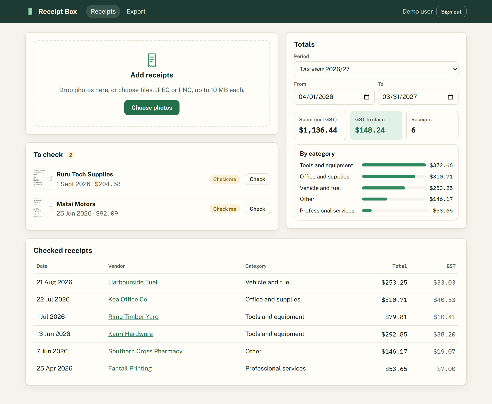
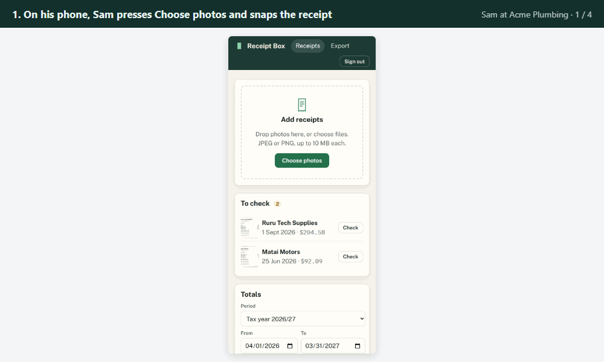
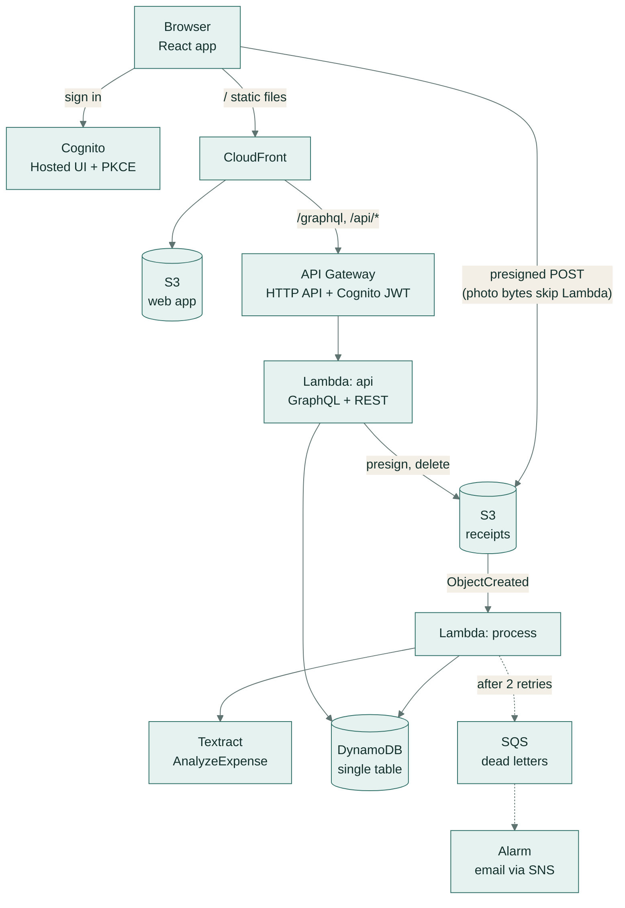
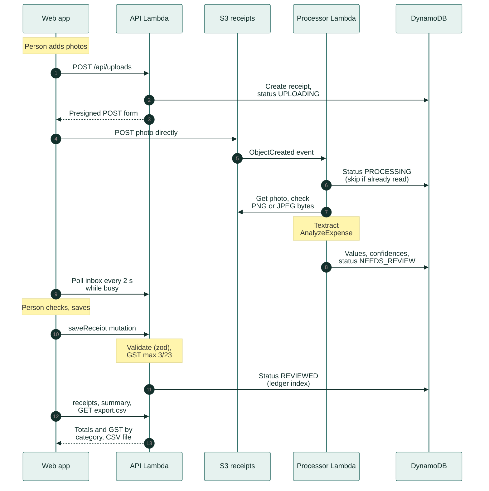
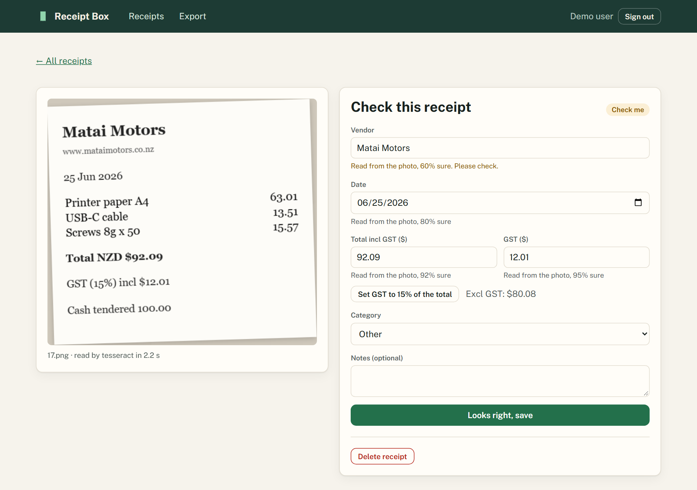
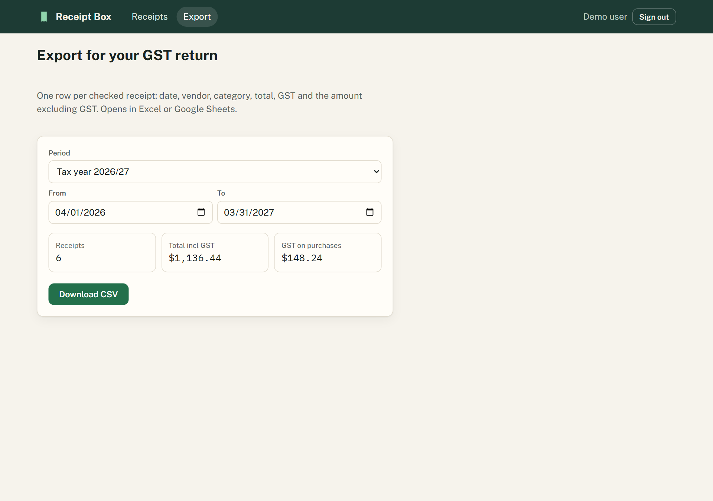
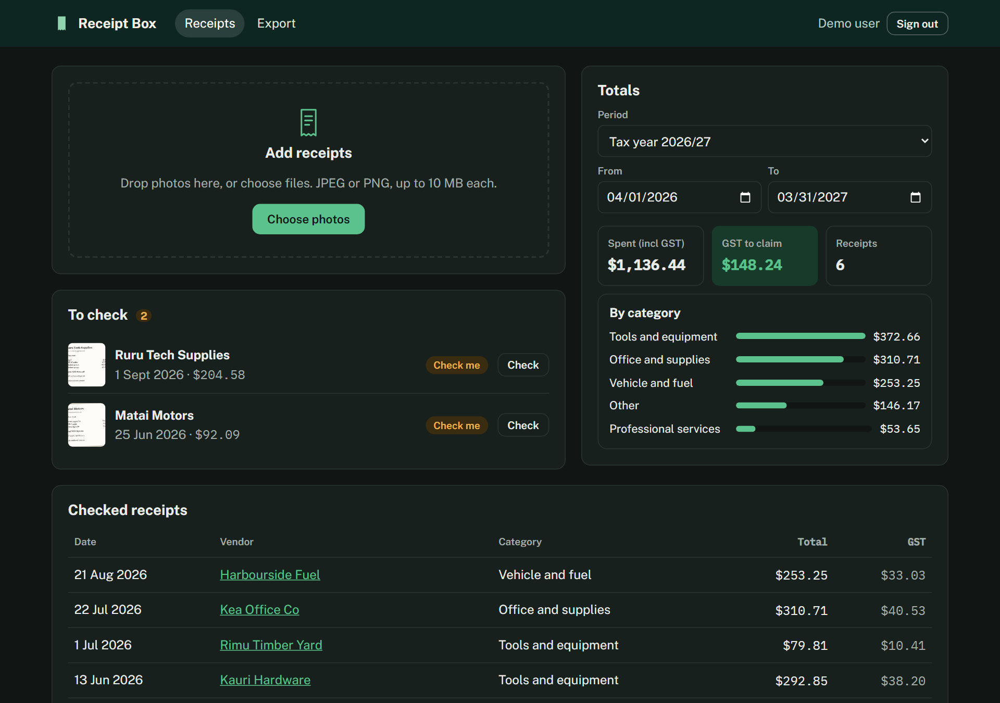
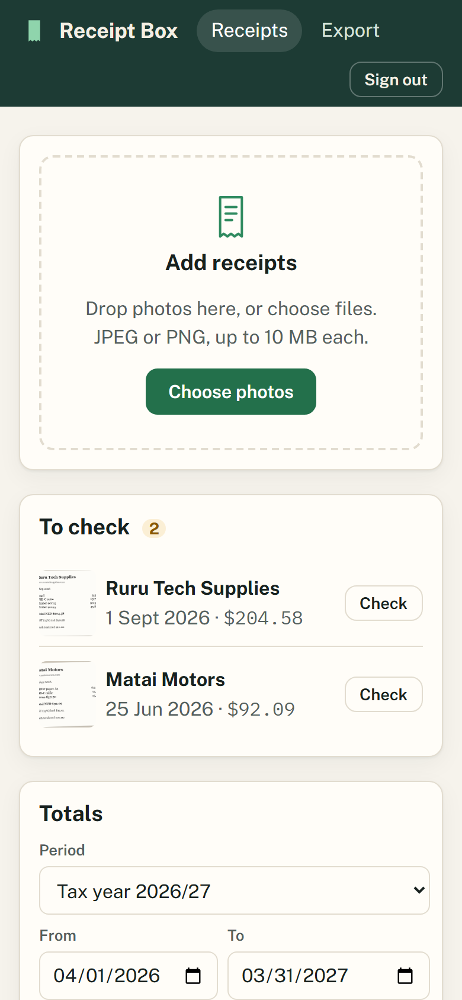

# Receipt Box

[](https://github.com/samiulhuda360/receipt-box/actions/workflows/ci.yml)


**Snap a photo of a receipt and it fills in the shop, date, total and GST for you, then adds up what you can
claim back at tax time.**



*The main page. Top: add receipt photos. Middle: receipts waiting for you to check. Bottom: how much you spent
and how much GST you can claim, split by category, for the tax year.*

## What it does

Receipt Box is for people who run their own small business in New Zealand. You take a photo of each receipt, and
it reads the shop name, date, total and GST (goods and services tax) for you. You glance at each one to confirm
it, and at tax time it gives you the totals, or a spreadsheet file, ready for your GST return.

## A real-life example



*Sam's receipts from photo to GST return, in four steps.*

Sam runs Acme Plumbing on his own.

- **Before:** receipts for parts, fuel and tools pile up in the van. Every two months, when his GST return is
  due, he types each one into a spreadsheet by hand, works out the GST on each, and hopes he didn't miss or
  mistype any. Faded or lost receipts mean GST he could have claimed back.
- **With Receipt Box:** he photographs each receipt on his phone the day he gets it. Moments later it
  shows up as "Check me" with the shop, date, total and GST filled in. He compares them with the photo, fixes
  anything marked "Please check", picks a category such as "Fuel" and saves.
- **After:** when the return is due, he picks "last two months" and sees what he spent and the GST to claim, by
  category, then downloads the spreadsheet. In tests on 30 sample receipts it read the date correctly every
  time, the total 97% of the time and the GST 93% of the time, in about 0.2 seconds per receipt. Because Sam
  checks every receipt before it counts, the rare misread is caught before it reaches his return.

## How you would use it

1. Open Receipt Box in your browser or on your phone and sign in.
2. Press **Choose photos** (or drop photos onto the page). On a phone you can take the photo straight away.
3. Wait a moment while each receipt changes from **Uploading** to **Reading** to **Check me**.
4. Open a receipt, compare the filled-in details with the photo, fix anything marked "Please check", choose a
   category and press **Looks right, save**.
5. To see your totals, pick a period, such as this month or the tax year, on the receipts page.
6. For your GST return, go to **Export**, pick the period and press **Download CSV** to get a spreadsheet file.

## In technical terms

Receipt Box turns receipt photos into GST-ready expense records for New Zealand sole traders: upload a photo,
check the vendor, date, total and GST read from it, and export totals by category for a GST return or the tax
year. It is a React + TypeScript web app on a serverless AWS back end (Amazon's cloud, where the code runs only
when needed and there are no servers to manage): Lambda (the code), API Gateway (the front door for requests),
DynamoDB (the database), S3 (photo storage), Cognito (sign-in) and Textract (Amazon's receipt-reading AI). It
offers GraphQL and REST APIs (ways for other programs to talk to it), AWS CDK infrastructure (the cloud setup
written as code) and CI (automatic tests on every change), and it also runs locally without an AWS account.

## Key features

- **Capture from a phone or a desktop.** Drop or choose JPEG and PNG photos (up to 10 MB each, several at once) and watch each upload's progress. Photos go from the browser straight to a private S3 bucket through a presigned POST.
- **Automatic reading with confidence scores.** Vendor, date, total and GST are read by Amazon Textract `AnalyzeExpense` on AWS, or locally by Tesseract OCR plus parsing rules for New Zealand receipts (day-first dates, GST checked against 3/23 of the total, change and cash tendered ignored).
- **A person confirms every receipt.** The review screen shows the photo beside the form, says how sure the reader was about each field, asks for a check below 80%, and has a one-click "15% GST" helper.
- **An inbox that updates itself.** New receipts move from Uploading to Reading to "Check me" without a page refresh. A photo that can't be read becomes "Enter by hand" instead of blocking anything.
- **Totals for any period.** Spending and GST to claim, overall and by category, for this month, last month, the last two months (a two-monthly GST period), the NZ tax year (1 April to 31 March) or custom dates. The period lives in the URL, so a view can be bookmarked.
- **CSV for the GST return.** One row per checked receipt with the total including GST, the GST and the total excluding GST. Cells that could start a spreadsheet formula are neutralised.
- **Private per user.** Cognito sign-in (authorization code flow with PKCE), tokens checked by API Gateway before any code runs, and every query scoped to the signed-in user.
- **Operations built in.** Structured JSON logs with a correlation ID, X-Ray tracing, custom metrics, five CloudWatch alarms, a dashboard, a cost budget and a [runbook](docs/runbook.md).
- **Accessible and responsive.** Real labels, linked hints and errors, live regions, native keyboard-friendly controls, a phone layout and dark mode. The end-to-end tests include an axe accessibility scan.
- **Runs locally with no AWS account.** The same API code runs with a folder for S3, a JSON file for DynamoDB, Tesseract for Textract and a demo user for Cognito.

## Architecture



- **One origin.** CloudFront serves the React app from S3 and forwards `/graphql` and `/api/*` to API Gateway, so the browser never makes a cross-origin API call (no CORS preflights) and security headers are set in one place.
- **Uploads bypass Lambda.** The API signs an S3 POST policy that pins the object key, the content type and the size range, and the browser posts the photo straight to S3. There is no 6 MB Lambda payload limit to work around and no compute time spent moving bytes.
- **Event-driven processing that is safe to repeat.** An S3 `ObjectCreated` event invokes the processor. A receipt that has already been read is skipped, transient errors are retried, and an event that still fails lands in an SQS dead-letter queue that raises an alarm.
- **One table, three access patterns.** One receipt by ID, checked receipts by date range, and the "to check" inbox. Two sparse indexes mean each query reads only the rows it returns, and writes use optimistic locking with a version number.
- **Least privilege.** API Gateway rejects requests without a valid Cognito token before any Lambda runs. The API function can put, get and delete objects under `uploads/`; the processor can only read them and call Textract.

The design decisions, with the alternatives considered, are in [docs/architecture.md](docs/architecture.md). Alarms and troubleshooting steps are in [docs/runbook.md](docs/runbook.md).

## How it works



The numbers below match the arrows in the diagram.

1. **Upload (1 to 4).** The dropzone accepts JPEG and PNG files up to 10 MB and explains why anything else is refused ([`UploadDropzone.tsx`](apps/web/src/components/UploadDropzone.tsx)). `POST /api/uploads` validates the request with the shared zod schema, creates the receipt in DynamoDB with status `UPLOADING`, and returns a presigned POST for `uploads/<user>/<receipt id>/<file>` that expires after 5 minutes ([`app.ts`](services/api/src/app.ts), [`blob/s3.ts`](services/api/src/blob/s3.ts)). The browser posts the photo straight to S3 and shows the upload progress ([`api.ts`](apps/web/src/api.ts)).
2. **Reading (5 to 8).** S3 sends an `ObjectCreated` event for the `uploads/` prefix to the processor Lambda. [`processUpload`](services/api/src/process.ts) moves the receipt to `PROCESSING` only while it is `UPLOADING` or `PROCESSING`, so a repeated event for a receipt that has already been read is skipped. It checks that the file's first bytes really are PNG or JPEG, then runs the extractor: Textract `AnalyzeExpense` on AWS ([`textract.ts`](services/api/src/extract/textract.ts)), or Tesseract and the parsing rules locally ([`parse.ts`](services/api/src/extract/parse.ts)). Vendor, date, total and GST are saved with their confidence scores, amounts as integer cents, and the status becomes `NEEDS_REVIEW`.
3. **Inbox (9).** The web app re-fetches the `inbox` query every 2 seconds while any receipt is uploading or being read, and stops as soon as none is ([`hooks.ts`](apps/web/src/hooks.ts)).
4. **Check and save (10 and 11).** Under each field the review screen shows how sure the reader was, and below 80% it asks for a check. "Set GST to 15% of the total" fills in GST as 3/23 of the GST-inclusive total. The form and the `saveReceipt` resolver validate with the same zod schema: a vendor, a real date that isn't in the future, whole cents, and GST no more than 3/23 of the total ([`ReceiptForm.tsx`](apps/web/src/components/ReceiptForm.tsx), [`receipt.ts`](packages/shared/src/receipt.ts), [`resolvers.ts`](services/api/src/graphql/resolvers.ts)). The receipt becomes `REVIEWED`, which moves it from the inbox index to the date-sorted ledger index ([`dynamo.ts`](services/api/src/repo/dynamo.ts)).
5. **Totals and export (12 and 13).** The `receipts` and `summary` queries return the checked receipts and the totals for the chosen period: spending and GST to claim, overall and by category. `GET /api/export.csv` returns the same receipts as a CSV file ([`csv.ts`](packages/shared/src/csv.ts)).

**Failure handling**

- Throttling, timeouts and 5xx errors are re-thrown, so Lambda retries the event twice. An event that still fails goes to the SQS dead-letter queue, which raises an alarm.
- A file that can't be read (not really an image, or refused by the reader) marks the receipt `FAILED` with the message "We couldn't read this receipt. Enter the details by hand." The person fills in the same review form.
- A receipt that has been `PROCESSING` for more than 5 minutes can also be entered by hand.
- An upload that never arrives is set to expire 24 hours after it was started, and DynamoDB's TTL removes it.

In local mode the same code runs end to end: a folder stands in for S3 and enforces the same upload policy, the local server calls `processUpload` straight after an upload in place of the S3 event, a JSON file stands in for DynamoDB, and Tesseract reads the receipts ([`local/server.ts`](services/api/src/local/server.ts)).

## Screenshots

Taken from the app in local mode with the synthetic receipts in [`services/api/eval/receipts`](services/api/eval/receipts), by [`scripts/screenshots.ts`](scripts/screenshots.ts).

<table>
  <tr>
    <td width="50%"></td>
    <td width="50%"></td>
  </tr>
  <tr>
    <td><b>Review.</b> The photo sits beside the form and each field says how sure the reader was. The vendor here was read with 60% confidence, so it asks for a check. One click sets GST to 15% of the total.</td>
    <td><b>Export.</b> Receipts, total including GST and GST on purchases for the chosen period, here the 2026/27 tax year, with a CSV download.</td>
  </tr>
</table>

<table>
  <tr>
    <td width="75%"></td>
    <td width="25%"></td>
  </tr>
  <tr>
    <td><b>Dark mode.</b> The colours follow the system setting.</td>
    <td><b>Phone.</b> The receipts page at 390 px wide.</td>
  </tr>
</table>

## Tech stack

| Area | Technology | Code |
|---|---|---|
| Web app | React 19, TypeScript (strict), Vite, React Router, TanStack Query, react-hook-form, zod | [`apps/web`](apps/web/src) |
| API | Node.js 22 on AWS Lambda, Hono, GraphQL Yoga, GraphQL Code Generator for typed resolvers and operations | [`services/api`](services/api/src), [`codegen.ts`](codegen.ts) |
| Shared domain | GraphQL schema, money and GST maths in integer cents, NZ reporting periods, validation, CSV export | [`packages/shared`](packages/shared/src) |
| Data and files | DynamoDB (single table, two sparse indexes, TTL, point-in-time recovery), S3 (presigned POST and GET) | [`dynamo.ts`](services/api/src/repo/dynamo.ts), [`s3.ts`](services/api/src/blob/s3.ts) |
| Receipt reading | Amazon Textract `AnalyzeExpense`; tesseract.js locally | [`extract`](services/api/src/extract) |
| Sign-in | Amazon Cognito Hosted UI, OpenID Connect code flow with PKCE (oidc-client-ts, react-oidc-context) | [`auth-cognito.tsx`](apps/web/src/auth-cognito.tsx) |
| Edge | CloudFront, API Gateway HTTP API with a JWT authorizer | [`receipt-box-stack.ts`](infra/lib/receipt-box-stack.ts) |
| Infrastructure | AWS CDK in TypeScript, ARM Lambda functions bundled with esbuild | [`infra`](infra) |
| Observability | Powertools for AWS Lambda (logger, metrics, tracer), X-Ray, CloudWatch alarms and dashboard, SNS, AWS Budgets | [`observability.ts`](services/api/src/observability.ts) |
| Testing | Vitest, Testing Library, aws-sdk-client-mock, CDK assertions, Playwright, axe-core | [Testing](#testing) |
| CI/CD | GitHub Actions, GitHub OIDC to AWS with no stored keys | [`ci.yml`](.github/workflows/ci.yml) |

## Getting started

### Prerequisites

- Node.js 22 or later, and npm.
- Internet access the first time a receipt is read locally: tesseract.js downloads its English model once and caches it in `services/api/.data/tesseract`.
- For the end-to-end tests: Playwright's Chromium (`npx playwright install chromium`).
- For deployment only: an AWS account and credentials for the AWS CLI.

### Install

```bash
git clone https://github.com/samiulhuda360/receipt-box.git
cd receipt-box
npm install
```

### Configuration

Local mode needs no configuration file and no secrets. These environment variables are optional:

| Variable | Used by | Purpose |
|---|---|---|
| `PORT` | Local API | Port to listen on, default 8787 (the web dev server proxies to 8787) |
| `DATA_DIR` | Local API | Data folder, default `services/api/.data`: the JSON database, the uploaded photos and the OCR model cache |
| `RESET_DATA` | Local API | `1` starts with an empty database and no photos |
| `EXTRACTOR` | Local API | `tesseract` (default), or `text` to skip OCR and parse the text that follows a `---text---` line in the uploaded file |
| `POWERTOOLS_LOG_LEVEL` | API and processor | Log level, for example `WARN` |
| `TABLE_NAME`, `BUCKET_NAME` | Lambda functions | The DynamoDB table and the receipts bucket; set by the CDK stack |

The web app reads its runtime settings from `/config.json`. [`apps/web/public/config.json`](apps/web/public/config.json) sets `authMode: "dev"` for local mode, and on AWS the CDK stack writes the Cognito settings (`authority`, `clientId` and `domain`) at deploy time, so the same build runs in both places.

### Run locally

```bash
npm run dev
```

This starts the API in local mode on http://localhost:8787 and the web app on http://localhost:5173. Vite proxies `/graphql`, `/api` and the photo uploads and downloads to the API, so the browser talks to one origin, as it does on AWS. Open http://localhost:5173, choose **Continue as demo user**, and add a few of the synthetic receipts from [`services/api/eval/receipts`](services/api/eval/receipts).

| Command | What it does |
|---|---|
| `npm run start -w @receipt-box/api` | Starts the API only, without watching files |
| `npm run build`, then `npm run preview -w @receipt-box/web` | Builds the web app for production and serves it on port 5173 (start the API as well) |
| Open http://localhost:8787/graphql | GraphiQL, available in local mode only |

## Usage

### In the browser

1. **Sign in.** Locally, choose **Continue as demo user**. On AWS, use the Cognito sign-in page, which also handles sign-up with email verification.
2. **Add receipts.** Drop photos on **Add receipts** or press **Choose photos**. On a phone the picker can take a photo directly.
3. **Let them be read.** Each receipt moves through **Uploading** and **Reading** to **Check me** in the **To check** list, or to **Enter by hand** if it can't be read.
4. **Check.** Open a receipt, compare the fields with the photo, fix anything marked "Please check", pick a category and press **Looks right, save**. **Delete receipt** removes the photo and its details.
5. **See totals.** Pick a period on the receipts page to see the spending including GST, the GST to claim, the number of receipts, totals by category and the list of checked receipts.
6. **Export.** On **Export**, pick the period and press **Download CSV**.

### API

One Lambda function serves every route, and the local server runs the same app. On AWS, every route except `/health` needs `Authorization: Bearer <Cognito access token>`, which API Gateway checks; locally, requests run as the demo user (or as the user named in an `x-dev-user` header).

| Method and path | Purpose |
|---|---|
| `GET /health` | Health check; no sign-in needed |
| `POST /graphql` | GraphQL. Queries: `inbox`, `receipts(from, to)`, `receipt(id)`, `summary(from, to)`. Mutations: `saveReceipt(id, input)`, `deleteReceipt(id)` |
| `POST /api/uploads` | Starts an upload. The body is `{ fileName, contentType, size }` for a JPEG or PNG of up to 10 MB; the response (`201`) has the `receiptId` and the presigned POST `url` and `fields` |
| `GET /api/export.csv?from=yyyy-mm-dd&to=yyyy-mm-dd` | Downloads the checked receipts in the period as CSV |
| `POST /api/telemetry` | Takes a browser error report (up to 16 KB) and logs it next to the API logs |

Money is integer cents (NZD) and dates are `yyyy-mm-dd` strings. Validation errors are GraphQL errors with `extensions.code` (`BAD_USER_INPUT` or `NOT_FOUND`) and `extensions.fields`, which names each invalid input. Responses carry an `x-request-id` header that matches the `correlation_id` in the logs. The schema is in [`schema.ts`](packages/shared/src/schema.ts).

Examples against the local API:

```bash
curl -s http://localhost:8787/graphql -H 'content-type: application/json' \
  -d '{"query":"{ inbox { id status vendor totalCents gstCents } }"}'

curl -s "http://localhost:8787/api/export.csv?from=2026-04-01&to=2027-03-31"
```

## Project structure

```
receipt-box/
├── apps/web/            React app: pages, components, hooks, typed GraphQL operations (src/gql is generated)
├── services/api/        API and processor Lambdas
│   ├── src/             routes, resolvers, processor, Textract and Tesseract readers, DynamoDB and S3 adapters, local server
│   ├── test/            unit and integration tests: API flow, processor, parsing rules, AWS adapters, Lambda handlers
│   └── eval/            synthetic receipts, ground truth, evaluation runner and results
├── packages/shared/     GraphQL schema, money and GST maths, periods, validation, CSV export
├── infra/               AWS CDK app (ReceiptBox and ReceiptBoxGithub stacks) and its assertion tests
├── e2e/                 Playwright end-to-end tests
├── scripts/             screenshot capture for this README
├── docs/                architecture decisions, runbook, screenshots
├── codegen.ts           GraphQL code generation config
└── .github/workflows/   CI and deployment pipeline
```

## Testing

```bash
npm test                          # 59 unit and integration tests (Vitest) in all four workspaces
npm test -w @receipt-box/api      # the tests of one workspace
npx playwright install chromium   # once, for the end-to-end tests
npm run e2e                       # 3 Playwright tests against the local stack
npm run lint                      # ESLint
npm run typecheck                 # TypeScript in every workspace
npm run codegen                   # regenerates the GraphQL types from the schema
npm run synth                     # synthesizes the CDK stacks, bundling both Lambdas
```

| Suite | Tests | What it covers |
|---|---|---|
| `packages/shared` | 11 | GST as 3/23 of the total, money parsing and formatting, tax-year and month boundaries, validation rules, CSV quoting and formula neutralising |
| `services/api` | 24 | The receipt journey through the API in-process (upload, read, review, totals, CSV), per-user isolation, idempotent processing and error classes, the image byte check, the parsing rules, DynamoDB keys and optimistic locking, Textract field mapping, and both Lambda handlers with API Gateway and S3 event shapes |
| `apps/web` | 12 | Form conversion and validation, confidence hints, the GST helper, server field errors shown next to the right input, upload checks and progress, lists and totals |
| `infra` | 12 | CDK assertions: private, encrypted, TLS-only buckets; an S3 trigger for uploads only; table backups, TTL and indexes; ARM and X-Ray; retries and the dead-letter queue; least-privilege IAM; a JWT on every route except `/health`; throttling and access logs; one CloudFront origin; a code-flow client without a secret; alarms, dashboard and budget; the GitHub OIDC trust |
| `e2e` | 3 | Upload a receipt image from the evaluation set, check the values Tesseract read, save, and find the receipt in the tax-year totals and the CSV; enter an unreadable file by hand with the GST helper; refuse a PDF before upload. The receipts page and the review screen are scanned with axe (WCAG 2 A and AA rules) |

`npm run e2e` starts the API with an empty local database (`RESET_DATA=1`) and the web app, unless they are already running, and runs the tests in Chromium with real OCR.

### CI

[`.github/workflows/ci.yml`](.github/workflows/ci.yml) runs on pushes to `main`, on pull requests and on demand:

1. **check:** generated GraphQL types match the schema, ESLint, type checks, unit and integration tests, the production build, and `cdk synth`, which bundles both Lambdas with esbuild.
2. **e2e:** the Playwright tests with real OCR. The OCR model is cached between runs, and the Playwright report is uploaded when a test fails.
3. **deploy:** after both jobs pass on a push to `main`, once the `AWS_DEPLOY_ROLE_ARN` repository variable is set. It deploys the `ReceiptBox` stack through GitHub OIDC, then smoke-tests the site: the page loads, and the API answers 401 to a request without a token.

## Evaluation

Receipt reading is measured on 30 synthetic New Zealand receipts with known answers: ten each of a thermal till slip, a café docket and a tax invoice, rendered by headless Chromium with fictional vendors, NZ date formats, 15% GST and some noise (slight rotation, blur and JPEG compression). The generator is [`make-receipts.ts`](services/api/eval/make-receipts.ts) and the runner is [`run.ts`](services/api/eval/run.ts).

Results for Tesseract (the local reader), from [`results-tesseract.md`](services/api/eval/results-tesseract.md):

| Layout | Receipts | Vendor | Date | Total | GST | Total and GST | All four |
|---|---|---|---|---|---|---|---|
| Thermal till slip | 10 | 100% | 100% | 90% | 80% | 80% | 80% |
| Café docket | 10 | 90% | 100% | 100% | 100% | 100% | 90% |
| Tax invoice | 10 | 80% | 100% | 100% | 100% | 100% | 80% |
| **All** | **30** | **90%** | **100%** | **97%** | **93%** | **93%** | **83%** |

The median reading time is 0.2 s per receipt. A date, total or GST value counts only on an exact match, with amounts right to the cent. A vendor counts if it matches when case, punctuation and macrons are ignored, or if one name contains the other. The report lists every miss next to what was read.

```bash
npm run eval                            # Tesseract; rewrites services/api/eval/results-tesseract.md
npm run eval -- --engine textract       # Amazon Textract; needs AWS credentials, writes results-textract.md
npm run eval:make -w @receipt-box/api   # regenerates the receipts and truth.json from a fixed seed
```

The synthetic receipts are cleaner than photos of crumpled paper, which is why every value carries a confidence score and a person confirms each receipt before it counts.

## Deploy to AWS

The CDK app in [`infra`](infra) defines everything in the architecture diagram. It deploys to the default region of your AWS CLI configuration, or to Sydney (`ap-southeast-2`) when none is set.

```bash
npm run build                                             # the web app that the stack uploads
cd infra
npx cdk bootstrap                                         # once per AWS account and region
npx cdk deploy ReceiptBox -c alarmEmail=you@example.com
```

The stack prints its outputs: `SiteUrl` (the app), `UserPoolId`, `ReceiptsBucket`, `TableName` and `DeadLetterQueue`. Open the site URL and sign up on the Cognito page. Confirm the SNS subscription email to receive the alarms.

| Context option | Default | Purpose |
|---|---|---|
| `alarmEmail` | none | Email address for the five alarms and the budget warnings |
| `budgetUsd` | 5 | Monthly cost budget in USD, with warnings at 80% (actual) and 100% (forecast) |
| `keepData` | `false` | `true` keeps the table, the user pool and the receipts bucket when the stack is deleted; by default `cdk destroy` removes everything |
| `githubRepo` | set in [`cdk.json`](infra/cdk.json) | The repository whose `main` branch may deploy through GitHub OIDC |

From `infra`, `npx cdk diff` shows pending changes and `npx cdk destroy ReceiptBox` removes the stack.

**Deploying from GitHub Actions.** Deploy the OIDC stack once:

```bash
cd infra
npx cdk deploy ReceiptBoxGithub
```

Then set the repository variable `AWS_DEPLOY_ROLE_ARN` to its `DeployRoleArn` output, and optionally `ALARM_EMAIL` and `AWS_REGION` (default `ap-southeast-2`). From then on, every push to `main` that passes CI is deployed and smoke-tested. The deploy role trusts only this repository's `main` branch and can only assume the CDK deployment roles, so no AWS keys are stored in GitHub.

## Scope

- Receipts are JPEG or PNG images of up to 10 MB, read with Textract's synchronous `AnalyzeExpense`. Multi-page PDFs need Textract's asynchronous API.
- The GST helper and the validation assume New Zealand GST of 15%, included in the total. A GST-free receipt is saved with GST 0, and the GST on a mixed receipt is typed in.
- Data stays in the AWS region the stack is deployed to.

## Licence

[MIT](LICENSE). The receipts in `services/api/eval/receipts` are synthetic, and their vendors are fictional.
