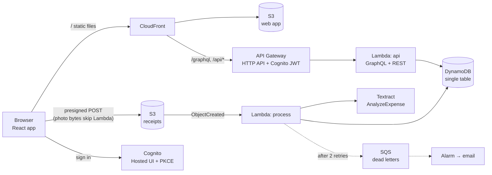

# Receipt Box

**Snap a receipt, check what was read, export GST-ready totals.** A React + TypeScript web app on a serverless AWS backend (Node.js Lambda, API Gateway, DynamoDB, S3, Cognito, Textract), with GraphQL and REST APIs, infrastructure as code, CI/CD and production monitoring.

[](https://github.com/samiulhuda360/receipt-box/actions/workflows/ci.yml)


## The problem

New Zealand sole traders keep receipts for two reasons: to claim back GST (15%) and to claim expenses in their tax return. Most of them keep a shoebox and a spreadsheet. Receipt Box replaces both:

1. **Snap or upload** a receipt photo. It goes straight from the browser to private storage.
2. **The backend reads it**: vendor, date, total and GST (Amazon Textract on AWS, Tesseract locally). Each value comes with a confidence score.
3. **You check it** in a review screen that points at anything the reader wasn't sure about, with a one-click "15% GST" helper.
4. **Totals and export**: spending and GST to claim by category, for any period or the NZ tax year (1 April to 31 March), and a CSV for the GST return.

<table>
<tr>
<td width="62%"></td>
<td width="38%"></td>
</tr>
</table>

## How it maps to the stack

| Area | What's here | Where |
|---|---|---|
| **React web app** | React 19 + TypeScript (strict), TanStack Query for server state (caching, invalidation, polling only while something is processing), React Router with state in the URL, react-hook-form + zod, route-level code splitting, accessible markup (real labels, `aria-describedby` hints and errors, live regions, native controls that work by keyboard) | [`apps/web`](apps/web/src) |
| **APIs: GraphQL and REST** | GraphQL (Yoga) for the app's data, typed end to end by codegen; REST where REST fits better: starting an upload, downloading a CSV file, browser error reports | [`schema.ts`](packages/shared/src/schema.ts), [`app.ts`](services/api/src/app.ts) |
| **Node.js backend** | Two TypeScript Lambda functions: the API (Hono + Yoga) and an S3-triggered receipt processor that is idempotent and retries only transient errors | [`services/api`](services/api/src) |
| **AWS serverless** | Lambda (ARM), API Gateway HTTP API with a Cognito JWT authorizer, DynamoDB single-table design with two sparse indexes, S3 presigned POST uploads, Textract AnalyzeExpense, SQS dead-letter queue, CloudFront | [`infra/lib`](infra/lib/receipt-box-stack.ts) |
| **CI/CD** | GitHub Actions: codegen drift check, lint, types, 59 unit and integration tests, build, `cdk synth`, Playwright end-to-end tests; deploys to AWS through GitHub OIDC (no stored keys), then smoke-tests the live site | [`.github/workflows/ci.yml`](.github/workflows/ci.yml) |
| **Monitoring and logging** | Structured JSON logs with a correlation id from the browser through API Gateway to every Lambda log line; X-Ray tracing; custom metrics; 5 alarms to email; a CloudWatch dashboard; a $5 budget; a [runbook](docs/runbook.md) | [`observability.ts`](services/api/src/observability.ts), [runbook](docs/runbook.md) |

## Architecture



- **One origin.** CloudFront serves the app and forwards `/graphql` and `/api/*` to API Gateway, so the browser never makes a cross-origin call to the API: no CORS preflights, and one place for security headers.
- **Uploads bypass Lambda.** The API signs an S3 POST policy that pins the exact key, the content type and the size. The browser posts the photo straight to S3. No 6 MB Lambda payload limit, and no compute time spent moving bytes.
- **Processing is event-driven and safe to repeat.** S3 can deliver an event twice, so the processor skips a receipt it has already read. Transient errors are retried; unreadable images become "Enter by hand"; anything that still fails lands in a dead-letter queue that raises an alarm.
- **One table, three access patterns.** Get one receipt, list reviewed receipts by date, list the to-check inbox. Two *sparse* indexes mean each query reads only the rows it returns. Writes use optimistic locking (a version number), so two updates can't silently overwrite each other.

More detail and the trade-offs behind each choice: [docs/architecture.md](docs/architecture.md).

## Results

| What | Result |
|---|---|
| Tests | **59 unit and integration tests** (shared 11, API 24, web 12, infrastructure 12) and **3 Playwright end-to-end tests** with accessibility scans (axe, WCAG 2 AA) |
| Receipt reading, local OCR (Tesseract) | On 30 synthetic NZ receipts: date **100%**, total **97%**, GST **93%**, vendor **90%**, all four fields **83%**; median **0.2 s** ([details](services/api/eval/results-tesseract.md)) |
| Initial JavaScript | **136 KB** gzipped, down from 185 KB: GraphQL operations are sent as precompiled strings (no GraphQL client library in the browser), and the review page, export page and Cognito client load on demand |
| Lambda bundles | API and processor bundled with esbuild, AWS SDK included so production runs exactly the tested versions |

Textract can be evaluated on the same set with `npm run eval -- --engine textract` (needs AWS credentials). The synthetic receipts are clean compared with crumpled real ones; the confidence scores and the review screen exist because no reader is perfect.

## Run it

Local mode runs the same API code as the Lambda, with a folder instead of S3, a JSON file instead of DynamoDB, Tesseract instead of Textract, and a demo user instead of Cognito. No AWS account needed.

```bash
git clone https://github.com/samiulhuda360/receipt-box && cd receipt-box
npm install
npm run dev            # API on :8787, web app on http://localhost:5173
```

```bash
npm test               # all unit and integration tests
npx playwright install chromium && npm run e2e   # end-to-end, starts the stack itself
npm run eval           # OCR accuracy on the synthetic receipts
```

### Deploy to AWS

```bash
npm run build                      # the React app the stack uploads
cd infra
npx cdk bootstrap                  # once per AWS account and region
npx cdk deploy ReceiptBox -c alarmEmail=you@example.com
```

The stack prints the site URL. For automatic deploys from GitHub, deploy the `ReceiptBoxGithub` stack once, set the repository variable `AWS_DEPLOY_ROLE_ARN` to its output, and every push to `main` that passes CI is deployed and smoke-tested.

## Project layout

```
apps/web            React app: pages, components, hooks, typed GraphQL operations (src/gql is generated)
services/api        Lambda handlers, GraphQL resolvers, REST routes, DynamoDB/S3/Textract adapters,
                    local server, OCR evaluation (eval/)
packages/shared     GraphQL schema, money and GST maths (integer cents), periods, validation, CSV
infra               AWS CDK app and its assertion tests
e2e                 Playwright tests against the local stack
docs                architecture, runbook, stack guide, screenshots
```

## Engineering notes

A few problems the tests caught, and what changed:

- **One `GraphQLError`, two classes.** Under the test runner, GraphQL errors from resolvers came back as "Unexpected error". `graphql` ships CommonJS and ES module builds; Yoga loaded one and the resolvers the other, so Yoga's `instanceof` check failed and masked every error. Fixed by resolving one build in tests; the Lambda bundle has a single copy anyway.
- **A bad file crashed the server.** The local OCR library throws worker errors outside any promise. The processor now checks the first bytes of every upload (PNG/JPEG magic numbers) before reading it, since the upload policy pins the declared type but not the actual content, and the OCR worker has an error handler.
- **Contrast.** The first green failed WCAG AA (4.2:1 on white); the end-to-end accessibility scan flagged it and the palette was darkened for text.
- **Money is integer cents.** Totals, GST (3/23 of a GST-inclusive amount) and the CSV never touch floating point.

## Limitations

- Textract's synchronous API takes JPEG and PNG up to 10 MB; multi-page PDFs would need its asynchronous API.
- The GST helper assumes 15% GST included in the total; zero-rated and mixed receipts need the GST typed in.
- Data lives in the chosen AWS region (Sydney by default). Choose the region to match your data-residency needs.

## Roadmap

- Offline capture (service worker queue) for receipts snapped without signal.
- Duplicate detection (same vendor, date and total).
- Bank-feed matching for each receipt.

## Licence

MIT. The receipts in `services/api/eval/receipts` are synthetic: the vendors are fictional.
