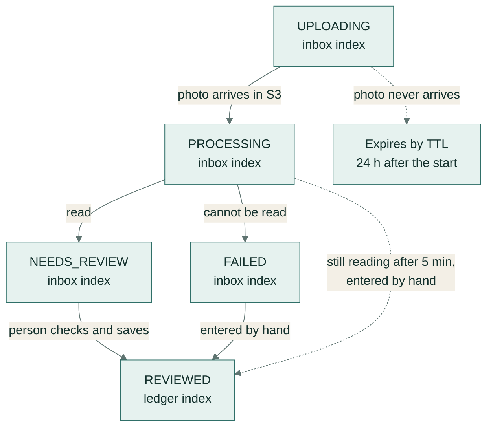

# Architecture decisions

Each decision with the alternative considered and the trade-off accepted. The request flow, step by step, is in the README's [How it works](../README.md#how-it-works) section.

## Receipt lifecycle

- The inbox shows every receipt that isn't `REVIEWED`. Totals, the ledger and the CSV export include only `REVIEWED` receipts.
- A `REVIEWED` receipt can be edited and saved again, and any receipt can be deleted together with its photo.
- A transient error while reading leaves the receipt in `PROCESSING` while Lambda retries the event.

## Data model

One DynamoDB table holds every receipt, with keys chosen for the app's three reads ([`dynamo.ts`](../services/api/src/repo/dynamo.ts)):

| Key | Partition key | Sort key | Read |
|---|---|---|---|
| Table | `USER#<user>` | `RECEIPT#<id>` | Get, update or delete one receipt |
| GSI1, the ledger | `USER#<user>` | `DATE#<date>#<id>` | Checked receipts in a date range, newest first |
| GSI2, the inbox | `INBOX#<user>` | `<createdAt>` | Receipts still to check, newest first |

Both indexes are sparse: an item carries GSI1 keys only once it is `REVIEWED` and dated, and GSI2 keys only until then. An item in `UPLOADING` also carries `expiresAt`, which the table's TTL uses. Every item has a `version` number for optimistic locking.

## 1. Serverless on AWS (Lambda, API Gateway, DynamoDB, S3)
- **Why:** traffic is small and bursty (receipts arrive in batches), so pay-per-request costs about nothing when idle, and there are no servers to patch.
- **Instead of:** a container on ECS/Fargate. That's simpler to debug locally and has no cold starts, but costs money around the clock.
- **Trade-off:** cold starts (kept small with bundled, minified functions and AWS clients created outside the handler) and Lambda's limits (6 MB payloads, which is why uploads go straight to S3).

## 2. One API function for all routes; a separate processor
- **Why:** one warm container serves GraphQL and REST, so cold starts are fewer and deploys simpler. The processor has different needs (Textract permission, 1 GB of memory, a 60 s timeout, an async retry policy).
- **Instead of:** one function per route, which allows finer permissions and scaling at the cost of more cold starts and more configuration.

## 3. GraphQL for data, REST for files and side effects
- **GraphQL:** the inbox, ledger, summary, save and delete. The client chooses fields, and codegen types both ends.
- **REST:**
  - `POST /api/uploads` returns a signed S3 form, not data;
  - `GET /api/export.csv` is a file download that browsers handle natively;
  - `POST /api/telemetry` is a fire-and-forget error report.

## 4. Browser → S3 presigned POST
- The POST policy pins the key, content type and size range, and S3 enforces them. The processor re-checks the bytes (magic numbers: PNG starts with `89 50 4E 47`, JPEG with `FF D8 FF`), because a policy can only check the declared type. A file that fails the check becomes `FAILED` before any OCR runs.
- Photos are shown through presigned GET links that expire after 5 minutes, so the bucket stays private.
- In local mode a folder applies the same checks (key, type, size and expiry), so uploads behave as they do against S3.
- **Instead of:** streaming through Lambda, which has a 6 MB limit and costs compute time.

## 5. DynamoDB single table with sparse indexes
- **Access patterns:** get by id; reviewed receipts by date range; unreviewed inbox. Two sparse GSIs mean each query reads only the rows it returns (see [Data model](#data-model)).
- **Optimistic locking** with a version number: read, merge, conditional put, and a retry if another write got in first. Writing the whole item keeps the index keys consistent with the status.
- **Instead of:** Aurora Serverless / Postgres. That's better for ad-hoc reporting and joins, but the access patterns here are fixed and small, so DynamoDB's on-demand cost and zero maintenance win.

## 6. Async processing with retries, idempotency and a DLQ
- S3 invokes the processor asynchronously, and Lambda retries it twice. The DLQ catches the rest, with an alarm.
- **Idempotent:** a duplicate event finds the receipt already read and skips it.
- **Error classes:** transient errors are re-thrown (retry); permanent ones mark the receipt FAILED (no point retrying), so the user can type it in.
- **Instead of:** an SQS queue between S3 and Lambda. That gives better batching and replay control; worth it at higher volume.

## 7. Textract on AWS, Tesseract locally, both behind one interface
- `Extractor` has one method. Textract AnalyzeExpense is a managed receipt model. Tesseract plus readable parsing rules lets the app, its tests and the evaluation run without an AWS account.
- **Parsing rules** ([`parse.ts`](../services/api/src/extract/parse.ts)): dates are read day-first, as in New Zealand (03/04/26 is 3 April), and a date that could be read either way gets a lower confidence. The total comes from lines such as "Total" or "Amount due", ignoring subtotals, change, cash tendered and rounding. A GST amount close to 3/23 of the total gets a high confidence. The vendor is the first line near the top that isn't an address, a phone number, a website or a GST number. With Tesseract, every confidence is also scaled by how clearly the OCR read the page.
- Textract's fields go through the same date and amount normalisation, keeping the most confident field of each type.
- The Tesseract worker has an error handler, so an OCR worker error can't stop the local API process.
- Every field carries a confidence score, and the UI asks people to check anything under 80%. **The person, not the model, has the final say.**

## 8. Same origin through CloudFront
- `/graphql` and `/api/*` are proxied to API Gateway. No CORS, no preflight latency, one place for security headers.
- Authorization headers are forwarded; caching is disabled for API paths.
- A CloudFront Function serves `index.html` for any path without a file extension, so a deep link such as `/receipts/<id>` works on refresh.

## 9. Cognito with the authorization code flow + PKCE, JWT checked at the gateway
- Bad or missing tokens are rejected by API Gateway before any Lambda runs. Resolvers scope every read and write to the token's `sub`.
- The browser client has no secret. Access tokens last one hour and are renewed silently.

## 10. Money as integer cents, dates as ISO strings
- Floating point can't represent 0.10 exactly, so all money is cents. GST included in a price is 3/23 of it.
- Dates are `yyyy-mm-dd` strings, so a receipt dated 31 March never slides into April because of a time zone.
- The CSV export writes plain decimals and prefixes any cell that starts with `=`, `+`, `-` or `@` with a quote, so a spreadsheet doesn't run it as a formula.

## 11. Infrastructure and delivery
- **CDK in TypeScript,** in the same language as the app, tested with assertions.
- **GitHub OIDC** for deploys: short-lived credentials limited to the main branch; no stored keys.
- **Observability built in:** structured logs with a correlation ID on every API request and the receipt ID on receipt log lines, X-Ray, metrics, 5 alarms, a dashboard and a budget.

## 12. Validation and errors
- One zod schema (`receiptInputSchema`) runs in the review form and in the `saveReceipt` resolver, so both reject the same input with the same messages. The upload limits (JPEG or PNG, 10 MB) are shared constants used by the dropzone, the API's request schema and the S3 policy.
- Resolver errors carry `extensions.code` (`BAD_USER_INPUT`, `NOT_FOUND`) and `extensions.fields`, and the form shows each message next to its input.
- Unexpected GraphQL errors are masked outside local mode, and an unhandled REST error returns a generic message with the request ID.
- GraphQL Yoga recognises its own errors with `instanceof GraphQLError`. The `graphql` package ships CommonJS and ES module builds, so the API's Vitest config resolves a single build; the esbuild Lambda bundle contains one copy.

## 13. Accessibility
- Native controls with real labels. Hints and errors are linked with `aria-describedby`, invalid fields are marked with `aria-invalid`, errors are announced with `role="alert"` and loading states with `role="status"`, and a skip link leads to the content.
- Text and buttons use a darker green than bars, icons and focus rings, so text meets WCAG AA contrast.
- The end-to-end tests fail on any serious or critical axe violation (WCAG 2 A and AA rules) on the receipts page and the review screen.

## Scope
- The app reads single-page JPEG and PNG receipts with Textract's synchronous API. Multi-page PDFs need `StartExpenseAnalysis` plus a completion notification.
- **Polling vs push:** the app polls every 2 seconds, and only while a receipt is being uploaded or read, which suits this scale. With many concurrent users, AppSync subscriptions or API Gateway WebSockets fit better.
- **Region:** Sydney by default. Choose a region that matches the data-residency policy.
